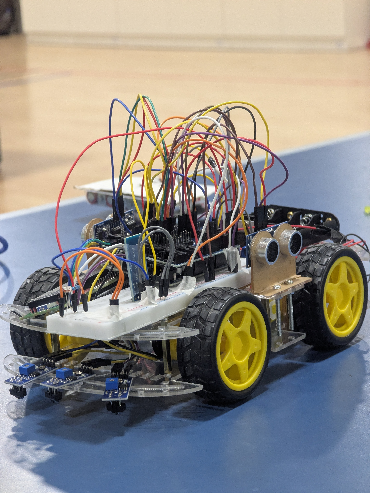

# 🤖 2025 CED Term Project: Autonomous Tic-Tac-Toe Robot

**Course:** Creative Engineering Design (2025)

**Project Type:** Autonomous Line Tracer & Game Solver

---

## 📖 Project Overview

This project involves the design and implementation of an autonomous robotic vehicle (using an Arduino Uno MCU) capable of navigating a track using various sensors and interacting with a physical game board. The robot's mission is divided into driving along a track, managing obstacles, and deriving an optimal move to win a game of **Tic-Tac-Toe**.

---

## 🎯 Project Objectives

1. 🚗 **Navigation:** Autonomous driving using **Left-First Search (LFS)** and line tracing algorithms.
2. 🚧 **Obstacle Management:** Handling environmental changes, such as temporary blackout zones using light sensors.
3. 📡 **Communication:** Wireless control (Stop/Start/mode switching) via Bluetooth.
4. 🧠 **Game Logic:** Detecting game pieces on a 3x3 board using ultrasonic sensors and calculating the optimal winning move with minimax algorithm.

---

## 🛠️ Hardware & Sensors

| Component | Description |
|-----------|-------------|
| **Controller** | Arduino Uno |
| **Navigation** | Line Tracer Sensors (IR) |
| **Environment Detection** | Light Sensor for blackout detection |
| **Object Detection** | Ultrasonic Sensors for scanning the game board pieces |
| **Communication** | Bluetooth Module (HC-05/06) |
| **Display** | LCD Screen (16x2) for game status and results |

---

## 🧩 Software & Algorithms

### 🗺️ Navigation Algorithm: Left-First Search (LFS)

The robot navigates the maze using the LFS algorithm, which prioritizes paths in a specific order to solve the maze structure.

**Logic Flow:**
```cpp
void loop() {
  if (path_on_left) {
      turn_left();
  } else if (path_ahead) {
      go_straight();
  } else if (path_on_right) {
      turn_right();
  } else {
      U_turn();
  }
}
```

---

## 🎮 Section 3: Game Board Exploration

The final stage involves the robot interacting with the Tic-Tac-Toe game board. This section tests the robot's ability to perceive its environment using ultrasonic sensors and perform logic calculations.

### 🎯 Objective

The robot must identify the current state of a 3x3 game board and calculate the **"Optimal Move"** to win the game or force a draw.


#### 🔍 A. Game Piece Detection

* **Task:** The robot scans the board to locate game pieces (paper cups or cones).

* **Constraint:** Results were only valid after the robot has come to a full stop.

#### 🧠 B. Optimal Move Derivation

* **Task:** After detection, the instructor verbally provided the position of the opponent's next move. The student enters this position via Bluetooth.
* **Output:** The robot must calculate and display the best next move on the LCD.
* **Rules:**
    * The move must lead to a victory or be the best logical move.
    * Only puzzles with a unique correct answer (or multiple valid winning moves) are used.

---

## 📸 Project Gallery

The following are images of the robot car build.

Note: I forgot to take a video of the car in action but with the code and a setuo of a tic tac toe environment, it works well.




---

## 🏆 Conclusion

This project successfully demonstrates the integration of autonomous navigation, sensor-based obstacle detection, and intelligent(somehow) game-solving algorithms. The robot's ability to navigate complex paths, detect environmental changes, and calculate optimal game moves showcases the practical application of engineering design principles.

---

**📅 Project Date:** December 2025  

**🎓 Course:** Creative Engineering Design - Year 1, Fall Semester